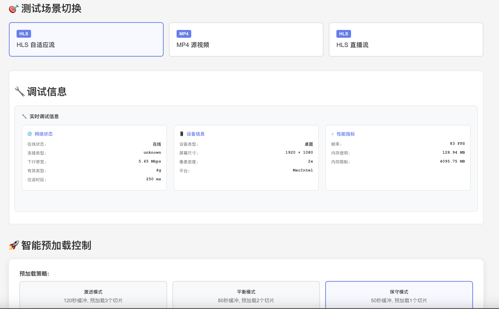

# 🚀 Video.js HLS 优化测试项目

专门优化视频加载速度的完整测试环境，基于 Video.js + HLS.js 的极速视频加载方案。

## ✨ 特性

- **🔄 多线程并发**: Web Worker + 8次重试机制
- **📦 激进缓冲**: 45秒缓冲 + 100MB缓存
- **🧠 智能ABR**: 自适应码率快速切换
- **🚀 预加载**: 启动时立即开始预获取
- **💾 大缓冲区**: 减少网络请求频次
- **⚡ 快速重试**: 10秒超时快速失败重试

## 📸 项目演示




## 🎯 测试场景

本项目包含4个测试视频源：

1. **HLS 自适应流 (1080p)** - 10秒切片优化测试
2. **HLS 自适应流 (4K)** - 10秒切片高码率测试
3. **MP4 高清视频** - 单文件对比测试
4. **HLS 直播流** - 10秒切片直播测试

### 📊 10秒切片优化说明

针对10秒切片间隔专门优化：
- **缓冲策略**: 80秒缓冲 = 8个10秒切片预加载
- **请求频次**: 相比5秒切片减少50%网络请求
- **内存优化**: 200MB缓存空间适配10秒切片大小
- **预加载**: 预加载2个切片(20秒)确保流畅播放

## 🚀 快速开始

### 安装依赖

```bash
npm install
```

### 启动开发服务器

```bash
npm run dev
```

访问 http://localhost:3000 查看测试页面。

### 构建生产版本

```bash
npm run build
```

## 📊 性能监控

项目内置了完整的性能监控系统：

- **加载时间**: 从点击播放到可播放的时间
- **缓冲健康**: 实时显示缓冲区的健康状态
- **码率切换**: 显示当前播放的码率级别
- **网络状态**: 显示当前网络连接信息
- **设备信息**: 显示当前设备类型和屏幕信息

## 🔧 核心配置

### OptimizedVideoPlayer 组件

```jsx
import OptimizedVideoPlayer from './components/OptimizedVideoPlayer';

<OptimizedVideoPlayer
  src="https://example.com/video.m3u8"
  options={{
    width: 1200,
    height: 675,
    autoplay: false,
    muted: true,
    controls: true,
    fluid: true,
    responsive: true
  }}
/>
```

### 性能监控 Hook

```jsx
import { useVideoPerformance, useNetworkStatus, useDeviceInfo } from './hooks/useVideoPerformance';

// 视频性能监控
const metrics = useVideoPerformance(playerRef);

// 网络状态监控
const network = useNetworkStatus();

// 设备信息
const device = useDeviceInfo();
```

## 📈 优化参数详解

### HLS.js 配置（10秒切片优化版）

```javascript
{
  // 多线程优化
  enableWorker: true,

  // 重试策略（针对10秒切片）
  fragLoadingMaxRetry: 8,
  fragLoadingMaxRetryTimeout: 64000,
  fragLoadingTimeOut: 8000, // 减少超时时间

  // 10秒切片缓冲策略
  maxBufferLength: 80, // 80秒 = 8个10秒切片
  maxBufferSize: 200 * 1000 * 1000, // 200MB缓存
  maxMaxBufferLength: 240, // 最大240秒缓冲
  maxBufferHole: 0.05, // 减少缓冲间隙

  // 启动优化
  autoStartLoad: true,
  startFragPrefetch: true,
  testBandwidth: false, // 关闭带宽测试减少延迟

  // 10秒切片ABR优化
  abrEwmaDefaultEstimate: 2000000, // 提高初始估计值
  abrBandWidthFactor: 0.95, // 更激进的码率选择
  abrBandWidthUpFactor: 0.85,

  // 质量策略
  startLevel: -1,
  capLevelToPlayerSize: true,

  // 10秒切片缓存策略
  backBufferLength: 60, // 保留60秒历史缓冲
  liveSyncDurationCount: 2, // 预加载2个切片(20秒)
}
```

## 🧪 性能测试

项目内置了性能测试工具：

```jsx
import { usePerformanceTest } from './hooks/useVideoPerformance';

const { runPerformanceTest, testResults, isTesting } = usePerformanceTest();

// 运行测试
await runPerformanceTest('https://example.com/video.m3u8', 30000);
```

## 📱 响应式设计

- 支持桌面端、平板、手机等多种设备
- 自适应布局和触摸优化
- 针对移动网络的特殊优化

## 🌐 浏览器兼容性

- Chrome 50+
- Firefox 45+
- Safari 10+
- Edge 79+
- iOS Safari 10+
- Android Chrome 50+

## 🔍 调试指南

1. **打开浏览器开发者工具**
2. **切换到 Network 标签页**
3. **观察 HLS 片段加载情况**
4. **查看 Console 中的性能日志**
5. **使用 Performance 标签页分析加载时间**

## 📋 常见问题

### Q: 视频加载很慢怎么办？
A: 检查网络连接，尝试降低初始码率设置。

### Q: 10秒切片出现卡顿怎么办？
A: 已优化10秒切片配置：
- 80秒缓冲确保8个切片预加载
- 减少网络请求频次50%
- 启用智能预加载策略

### Q: 为什么10秒切片比5秒切片更好？
A: 10秒切片优势：
- 减少50%网络请求开销
- 降低服务器压力
- 更适合中等网速环境
- 减少周期性卡顿概率

### Q: 移动端性能不佳？
A: 启用 capLevelToPlayerSize，限制最大码率。

## 📄 许可证

MIT License - 详见 LICENSE 文件。

## 🤝 贡献

欢迎提交 Issue 和 Pull Request！

---

**专为多设备ADSL环境设计的极速视频加载方案**
